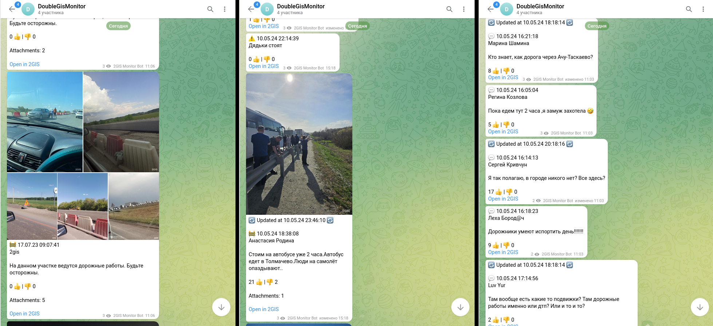
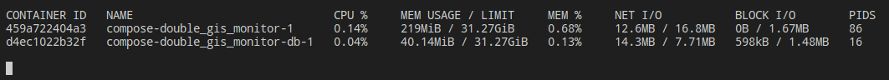

**2GIS Monitor** is a service that provides periodic fetching of events (aka comments)
from the [2GIS map](https://2gis.ru) directly to your Telegram channel.

The idea for creating the project was our Telegram channel, in which we posted interesting or funny comments on the map.

Interacting with the map and searching for comments manually takes a lot of time, especially since on some days
the number of messages on the map can reach >150.

The service solves this problem in four stages (I call it *event pipeline*):
receiving events -> processing events -> dispatching messages (to Telegram) -> store them in database.

## Screenshots





## Features

The event pipeline runs at a specified time interval. Let's take a look at the stages of the pipeline in more detail.

### Receiving information from the 2GIS server

The city and types of events that need to be received are specified in the configuration file.

The server requests information about events from 2GIS servers. Then, for each event, it receives attachments
(added photos from users).

### Event handling

Events on the map are temporary, that is, after some time they are deleted from the 2GIS system.
For this reason, the database is *cleaned* before each processing of received events.
It includes removing outdated events from the database that are no longer on the map.

Events received from the server after some processing can have three statuses:

- **Update** - the event is already in the database and has been updated (usually attachments or reactions are changed)
- **Insert** - a new event that has been added to the database
- *Skip* - the event is already in the database and has not changed since then

### Event dispatching

The dispatcher's task is to transmit information about updated and inserted events to the Telegram user.

The only option that works optimally and without problems is sending to a specified channel where the bot has access
to send posts.

There is also one technical limitation: if the event was first sent to the channel with, for example, one attachment,
and when the next pipeline was launched, the number of attachments increased,
then new photos will NOT be added to the post in Telegram.

All we can do in this situation is to place a mark at the beginning of the message indicating that the message
has been updated.

#### Interaction with the bot

The bot will ignore any messages outside the specified channel.
All you can do is send a post with a command to your channel, and the bot will respond to it with a new post.

## Run Locally

The service can be run locally.
This assumes that you already have a Postgres database instance running.

Downloading sources:

```bash
  git clone https://github.com/meequrox/2gis-monitor.git
  cd 2gis-monitor
```

Before proceeding to launch, you **MUST** set the required environment variables in the current shell.
All environment variables are described in detail in the file **[config/runtime.exs](config/runtime.exs)**
(yes, you will have to look at the comments in this file):

```bash
  DGM_TG_TOKEN="xxxxxxxxxx"
  DGM_TG_CHANNEL="-10xxxxxxxxxxx"
  DGM_CITY="Omsk"
  ...
```

Next, there are two ways to build and run the project:

### Launching a project "as is" in a development environment

Basically, this method is used only during development.

```bash
  mix deps.get

  iex -S mix
```

### Build the production release and launch

This method is used if you need to build a self-contained release of the application.

It should work **faster** by preloading all the code into memory.

```bash
  MIX_ENV=prod

  mix deps.get --only prod
  mix release --path release/double_gis_monitor

  ./release/double_gis_monitor/bin/double_gis_monitor start_iex
```

## Deployment

The project can be deployed in a Docker container.

It is preferable to do this using Docker Compose, as it automatically passes the necessary variables to the application.

Before starting the service, you **MUST** set the required environment variable values ​​in the .env file.
All environment variables are described in detail in the file **[config/runtime.exs](config/runtime.exs)**
(yes, you will have to look at the comments in this file):

```bash
  # Assuming we are in the root directory

  cd compose
  cp example.env .env
```

Now in the `.env` file, change the variable values ​​as required.

Start:

```bash
  docker compose up -d
```

Make sure everything started correctly:

```bash
  docker ps
  docker logs compose-double_gis_monitor-1
```

## Roadmap

I consider the project complete and do not plan to add new functionality.

However, there may be some problems that need to be addressed in the future:

- Reduce RAM usage
- Test coverage

## FAQ

#### Why Elixir?

This is my second more or less serious project in this language. I just started learning it and needed practice.

#### Can 2GIS block my IP because of this service?

Honestly: I don't know, but **most likely not**.
There are no hacks here, the service literally does everything that any other 2GIS mobile or browser client does.

#### I encountered an error or inaccuracy in the program!

It would be great if you open an issue and provide the logs.

#### I'm from the 2GIS team and I would like to discuss a few things.

You can find my contacts [here](https://github.com/meequrox#contacts).
